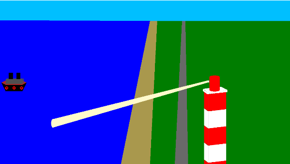
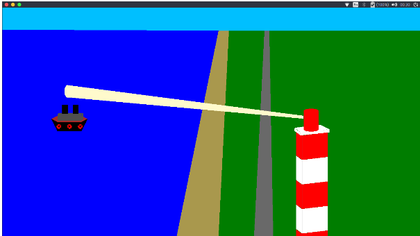

# Lighthouse
Animation of NITK Beach using OpenGL. 
Open Graphics Library (OpenGL) is a cross-language, cross-platform application programming interface (API) for rendering 2D and 3D vector graphics. The API is typically used to interact with a graphics processing unit (GPU), to achieve hardware-accelerated rendering.

## Installation

This requires a C complier to run the program. Follow the instruction to run the program:

### On Windows
- Open the cbp file with codeblocks.
- Build and run.

### On Ubuntu
- To compile the program: `gcc lighthouse2.c -lglut -lm -lGL -lGLU -o lighthouse`
- To run the program `./lighthouse`

### Resolution
- The current program runs perfectly in 1366 × 768 resolution.
- Before running the program the resolution can be changed in the program.
- Update SCREEN_WIDTH,SCREEN_HEIGHT according to your screen resolution

### Project Images
Before Rotation of the Beam and Movement of the Ship.
 

 
After Rotation of the Beam and Movement of the Ship.
 

### Project Inspiration

## Team Members
* [Nishant Kumar](https://github.com/NishantKr97),16IT123
* [Dhvanil Parikh](https://github.com/DhvanilP), 16IT217
* [Suyash Ghuge](https://github.com/suyash0103), 16IT114
